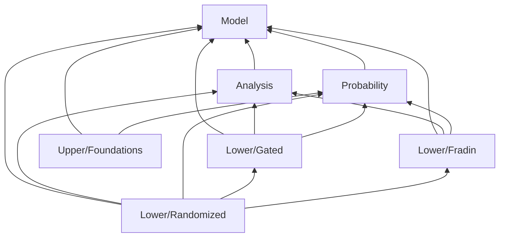

# HeavyTailedNoise

[](https://github.com/xiong-zx/heavy-tailed-noise-lean/actions/workflows/lean.yml)

A Lean 4 library for stochastic optimization under heavy-tailed oracle noise. Its main release target is the complete finite-q lower bound for arbitrary randomized strict-K=1 algorithms. The model, reusable analysis and probability, and individual constructions remain separate.

## Complete randomized lower theorem

Let `A = L Δ / ε²`, `t = σ / ε`, `r = p / (p-1)` and `B = t^r`.
For every `1<p≤2` and finite real `q≥1`, the public statement gives

\[
N_\epsilon > c_{p,q}\max\{A+B+AB^{1/q},\ A\max(1,t)^2\}.
\]

One absolute accuracy constant `c₀=1/√10,752,000` precedes p,q. A positive
`c_{p,q}` then precedes all positive L,Δ,ε and nonnegative σ, with
`ε≤c₀√(LΔ)`. The theorem includes q=1, finite q>2 and zero noise. The rate is
within a factor of two of the customary `B₊+A max{S₊²,S₊^(r/q)}` expression
in this accuracy regime; the exact Lean statement is the displayed max form.

The finite bad dimension is chosen from public parameters and the fixed natural
response budget before the algorithm. Algorithms may retain full history, use
arbitrary measurable private randomness, query anywhere and output an unqueried
point. They observe gradient responses only. This is the existing literal
dimension-uniform minimax definition, with no zero-respecting restriction or
expected-stopping-time replacement.

```lean
import HeavyTailedNoise.Lower.Full

#check HeavyTailedNoise.RandomizedLift.full_lower_bound_absolute_accuracy_and_fixed_parameter_constants
#check HeavyTailedNoise.RandomizedLift.full_lower_bound_refutes_response_budget
```

The complete lift previously passed independent native checks of its 23-module
checkpoint. Its 22 mathematical source files have now been moved into the single
canonical package, preserving proof bodies and theorem names; the old standalone
build and audit paths are retired. **The unified 218-module canonical native build,
complete provenance audit, 18-entry public signature/axiom audit and standalone
complete-entry import check passed on 27 September 2026.** See the [complete lower contract](docs/full-lower-contract.md).

## Gated lower theorem

Let `A = L Δ / ε²`, `S = σ / ε`, and let `Nε` denote the dimension-uniform minimax complexity measured in returned gradient vectors. The public large-parameter theorem establishes

\[
N_\epsilon > 10^{-25} A S^2
\]

for every `1 < p ≤ 2`, every finite real `q ≥ 1`, and positive `L, Δ, ε`, provided

\[
A \ge 21\,135\,360\,000, \qquad S \ge 10^7.
\]

One positive triple of absolute constants works for all these `p,q`. For each natural budget `N ≤ 10⁻²⁵ A S²`, the finite dimension and Haar prior are selected from the public parameters and budget before the algorithm. The same prior has average expected gradient norm strictly greater than `ε` for every measurable algorithm in that dimension. Consequently, each algorithm has a deterministic legal hard instance with risk greater than `ε`.

The algorithm may use arbitrary private randomness and its complete history, choose any query locations, and output any measurable point. Each fresh independent seed is used at one decision and returns one gradient vector. The seed, a sample function, and a function value are not observations. `N` is a deterministic response cap; the output needs no further response. The criterion is **expected gradient norm**, with risk in `ENNReal` when it is infinite.

The admissible class has a lower-bounded population objective, initial gap at most `Δ`, global unbiasedness, uniform centered `p`-moment bound `σᵖ`, and global same-seed `q`-increment bound `(L ‖x-y‖)ᑫ`. This gated branch covers finite `q`, its stated large-parameter regime and the `A S²` term. The baseline is supplied by the complete randomized branch above. `q = ∞`, an expected-stopping-time budget and a complete upper-rate theorem remain outside this certificate.

### Lean API

```lean
import HeavyTailedNoise.Lower.Gated

#check HeavyTailedNoise.gatedHaar_fixed_prior_average_risk_lower_bound
#check HeavyTailedNoise.gatedHaar_bad_legal_instance
#check HeavyTailedNoise.gatedHaar_refutes_dimension_uniform_guarantee
#check HeavyTailedNoise.gatedHaar_minimax_complexity_gt_response_budget
#check HeavyTailedNoise.gatedHaar_minimax_complexity_lower_bound
#check HeavyTailedNoise.gatedHaar_minimax_complexity_absolute_constants
```

The namespace, theorem names, and public constants are preserved by the module reorganization. `import HeavyTailedNoise` provides the aggregate library entry. The model alone is available through `import HeavyTailedNoise.Model.Basic`.

| Public statement | Source |
| --- | --- |
| Fixed-prior risk, bad instance, and failure of a dimension-uniform guarantee | [GatedHaarFiniteLowerBound](HeavyTailedNoise/Lower/Gated/GatedHaarFiniteLowerBound.lean) |
| Natural-budget minimax infimum and literal lower bound | [GatedHaarMinimaxComplexity](HeavyTailedNoise/Lower/Gated/GatedHaarMinimaxComplexity.lean) |
| Explicit thresholds and absolute-constant quantifiers | [GatedHaarPublicRegime](HeavyTailedNoise/Lower/Gated/GatedHaarPublicRegime.lean) |

## Fradin v2, Theorem 3.1

The separate original-response entry is:

```lean
import HeavyTailedNoise.Lower.Fradin
#check HeavyTailedNoise.Fradin.original_theorem31_constants
```

For `1<p≤2`, `1≤q≤2`, every shared-seed batch size `K≥1`, positive
`L,Δ,ε`, and `σ≥0`, assume `ε≤√(LΔ)/1024`. With `A=LΔ/ε²`, `S=σ/ε`
and `r=p/(p−1)`, a positive coefficient depending only on p gives the full
round-complexity lower bound `cₚ(S^r+A+AS^(r/q))`. This is the source's
`sup objective / sup oracle / inf zero-respecting algorithm / inf successful
natural round` order. The first batch slot is the explicit interpretation of
the source's undefined batch-gradient expression; the proof uses a common
failure event for all batch slots.

These algorithms observe only past population values and gradient vectors,
with one independent fresh seed shared by all preselected points in a round.
The kernel-checked response-only reconstruction bridge preserves the complete
algorithm class and complexity. The public theorem includes q=1, zero noise
and the small-chain noise fallback. Its complete source proof, canonical
native library build and public axiom audit passed. Independent clean-directory
release reproduction and its public axiom audit also passed.
See the [source contract and proof repair](docs/fradin-contract.md) for the
exact normalization, changed constants and the source C.2 support-index error.

## Library organization

The arrows mean that a construction uses the indicated reusable layer; individual module imports determine the precise dependency graph.



| Layer | Entry or examples | Responsibility |
| --- | --- | --- |
| `Model/` | [Basic](HeavyTailedNoise/Model/Basic.lean), [Protocol](HeavyTailedNoise/Model/Protocol.lean), [Distributional](HeavyTailedNoise/Model/Distributional.lean) | Admissibility, transcripts, risk, and algorithm quantifiers. |
| `Analysis/` | [CarmonChain](HeavyTailedNoise/Analysis/CarmonChain.lean), [Smoothness](HeavyTailedNoise/Analysis/Smoothness.lean) | Scalar functions, chain geometry, derivatives, and exact arithmetic. |
| `Probability/` | [GaussianOracle](HeavyTailedNoise/Probability/GaussianOracle.lean), [GaussianKL](HeavyTailedNoise/Probability/GaussianKL.lean), [HaarConditionalFrame](HeavyTailedNoise/Probability/HaarConditionalFrame.lean) | Oracle legality, conditional laws, information bounds, and concentration. |
| `Lower/Gated/` | [Public entry](HeavyTailedNoise/Lower/Gated.lean) | Gated objective, stopped process, coupling, public parameters, and minimax assembly. |
| `Lower/Randomized/` | [Complete lower entry](HeavyTailedNoise/Lower/Full.lean) | Unrestricted randomized baseline, actual stopped-posterior reflection symmetry, physical budgets and complete max-rate assembly. |
| `Lower/Fradin/` | [Source contract](docs/fradin-contract.md) | Separate response-only construction for Fradin et al. v2, Theorem 3.1; complete native proof, independent reproduction and public axiom audits passed. |
| `Upper/Foundations/` | [UpperMomentFoundations](HeavyTailedNoise/Upper/Foundations/UpperMomentFoundations.lean) | Fresh-batch coordinate moments and predictable unbiasedness. Batch-average moment decay, EMA analysis, and the final rate remain open. |

Reusable layers do not import a lower-bound construction. New constructions should share the model without importing another construction's internal proof path.

## Reproduce the checks

Install [elan](https://github.com/leanprover/elan), then run from this package directory:

```sh
lake exe cache get
lake build
lake env lean scripts/CheckAxioms.lean
```

[lean-toolchain](lean-toolchain) pins `leanprover/lean4:v4.34.0`. [lakefile.toml](lakefile.toml) and [lake-manifest.json](lake-manifest.json) pin mathlib to `5ed2965256430c3649e86755f9576b54eca72435`. Keep both files; `lake update` is a dependency change, not a reproduction step. The default Lake target builds the complete recursive proof library. [build-imac.sh](build-imac.sh) is an optional local cache driver using the same canonical package configuration.

[CheckAxioms.lean](scripts/CheckAxioms.lean) prints 18 public complete-lower, gated and Fradin signatures and checks their transitive axiom dependencies against `propext`, `Classical.choice`, and `Quot.sound`. It fails on any other axiom, including a proof placeholder. The [CI workflow](.github/workflows/lean.yml) repeats the standard build and this audit with fixed action revisions.

### Verification record

The previous 195-module package passed complete primary and independent fresh-directory native builds, provenance audits and ten-entry public signature/axiom audits on 27 September 2026. The independent directory received no earlier project proof objects; dependency caches used exact locked revisions. The randomized lift is integrated into the unique 218-module source package. Its canonical default native build exited 0 against 223 unchanged frozen source/configuration/driver/audit inputs. The complete provenance check verified all 218 native module outputs and traces, exact setup ownership and permitted import paths, nine locked clean dependencies, and the fixed compiler. The expanded 18-entry public audit exited 0; every entry uses exactly `propext`, `Classical.choice`, and `Quot.sound`. A separate source importing only `HeavyTailedNoise.Lower.Full` checked the two final public entry types and the same three axioms. No independent clean 218-module rebuild was performed; the earlier independent build covers the previous 195-module package. After acceptance, all 218 generated project setup files were losslessly archived and restored with matching hashes before removing their expanded copies. The 18-entry public audit and separate Full-entry import then passed again with unchanged sources, proof objects and dependencies. Private build records and caches are outside the public package. Hosted reproduction uses the same pinned configuration; see [GitHub Actions](https://github.com/xiong-zx/heavy-tailed-noise-lean/actions) for the current remote build results.

## Proof notes, sources, and contributions

- [Proof dependencies](docs/proof-dependencies.md) connect the complete randomized lower theorem, gated construction and separate original-response Fradin theorem.
- [Numerical proof repairs](docs/gated-proof-notes.md) explain the two invalid intermediate comparisons found during formalization and the exact replacement bounds.
- [Fradin source contract](docs/fradin-contract.md) records the normalized checked theorem, its proof repair, and its algorithm and query-model restrictions.
- [References](docs/references.md) distinguish source mathematics from formalized results.
- [Contributing](docs/contributing.md) describes proof, attribution, and validation requirements.
- [Project introduction](docs/index.md) is a short overview suitable for a personal research page.

The package's original code and documentation are released under the [MIT license](LICENSE). Dependencies and cited papers retain their own licenses. Use [CITATION.cff](CITATION.cff) to cite this formalization, and cite the original mathematical sources when using their results.
