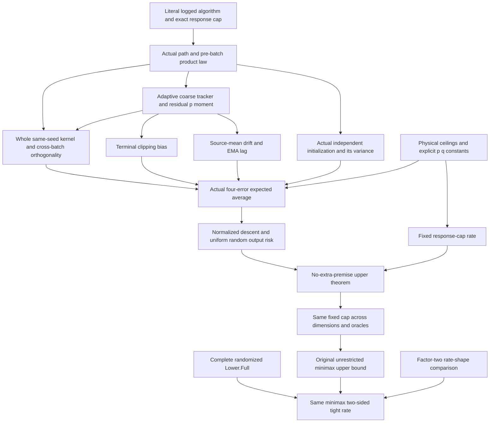
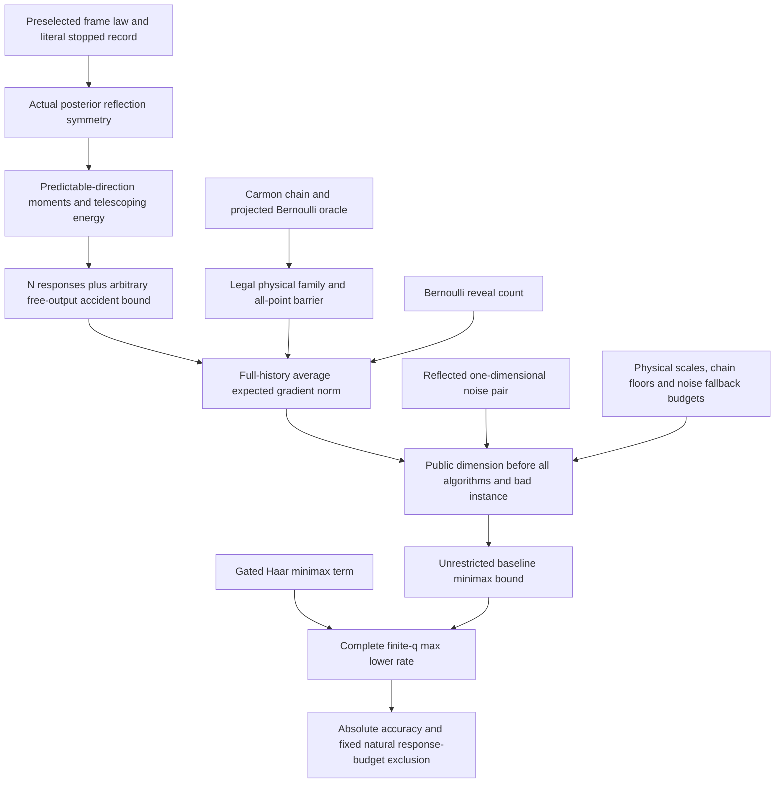
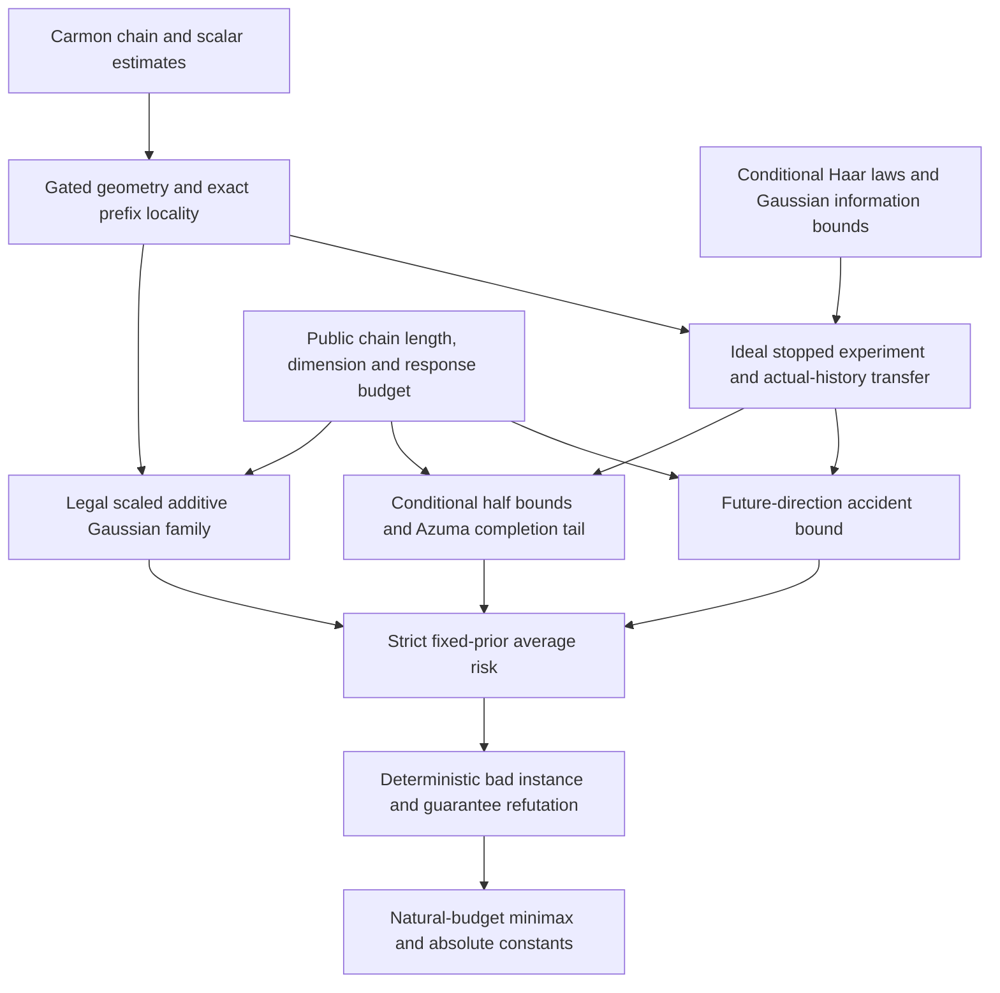
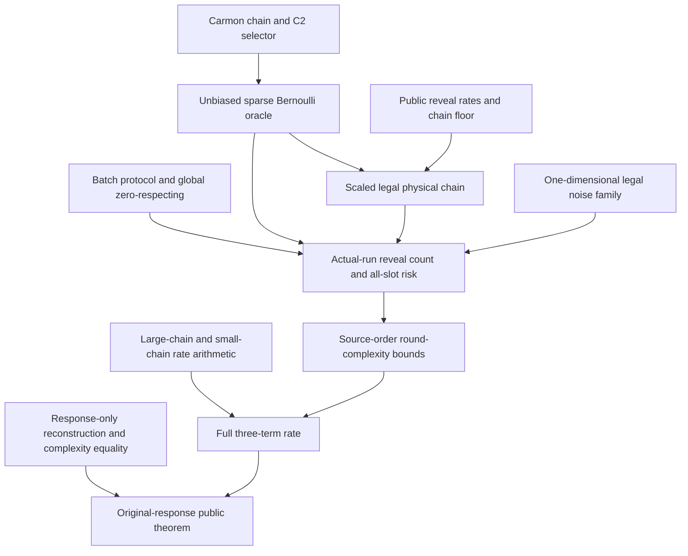

# Proof dependencies

These diagrams summarize mathematical dependencies, rather than every module
import. The [library overview](../README.md) gives the exact public statements
and verification record. Each construction discharges its own oracle and
probability obligations before the public theorem is assembled.

## Original shared-batch strict-K=1 upper bound

The public upper entry is `HeavyTailedNoise.Upper.Full`; `HeavyTailedNoise.TightRate`
connects it directly to `Lower.Full`. All responses in a runtime batch are at
the pre-batch point, from different independent fresh seeds. Each response
feeds every scale, so the full same-seed band sum is retained in the kernel
before taking its square or variance. The filtration is taken before the
whole batch, including the response later used to update the tracker.

| Obligation | Main source entry |
| --- | --- |
| Original state updates, gradient-only decisions and exact count | [Algorithm](../HeavyTailedNoise/Upper/K1/Algorithm.lean), [PhysicalParameters](../HeavyTailedNoise/Upper/K1/PhysicalParameters.lean) |
| Whole-batch pre-response history and fresh product-law reindexing | [BatchPastMeasurability](../HeavyTailedNoise/Upper/K1/BatchPastMeasurability.lean), [BatchSeedProduct](../HeavyTailedNoise/Upper/K1/BatchSeedProduct.lean), [BatchSeedReindex](../HeavyTailedNoise/Upper/K1/BatchSeedReindex.lean) |
| Actual tracker moment and residual p moment | [CoarseTrackerPaperScheduleMoment](../HeavyTailedNoise/Upper/K1/CoarseTrackerPaperScheduleMoment.lean), [ResidualPhysicalMoment](../HeavyTailedNoise/Upper/K1/ResidualPhysicalMoment.lean) |
| Within-seed kernel bound, actual centering and noise budget | [KernelPhiResidualMoment](../HeavyTailedNoise/Upper/K1/KernelPhiResidualMoment.lean), [ActualEstimatorKernelIdentity](../HeavyTailedNoise/Upper/K1/ActualEstimatorKernelIdentity.lean), [RuntimeNoiseNorm](../HeavyTailedNoise/Upper/K1/RuntimeNoiseNorm.lean) |
| Initialization, source-mean lag and terminal bias | [InitialMemoryNorm](../HeavyTailedNoise/Upper/K1/InitialMemoryNorm.lean), [EMADriftSeed](../HeavyTailedNoise/Upper/K1/EMADriftSeed.lean), [TerminalClipBiasExpectation](../HeavyTailedNoise/Upper/K1/TerminalClipBiasExpectation.lean) |
| Complete actual error average and risk conclusion | [EstimatorAverageBound](../HeavyTailedNoise/Upper/K1/EstimatorAverageBound.lean), [Main](../HeavyTailedNoise/Upper/K1/Main.lean) |
| Explicit constants and fixed response-cap rate | [ConvergenceConstants](../HeavyTailedNoise/Upper/K1/ConvergenceConstants.lean), [BudgetRateMax](../HeavyTailedNoise/Upper/K1/BudgetRateMax.lean) |
| Literal common minimax upper and lower statements | [UniformGuarantee](../HeavyTailedNoise/Upper/K1/UniformGuarantee.lean), [RateComparison](../HeavyTailedNoise/Upper/K1/RateComparison.lean), [TightRate](../HeavyTailedNoise/TightRate.lean) |

The intermediate risk bridge's estimator-error premise is discharged by
`EstimatorAverageBound` in `Main`. The private-index universe lifting proves
exact risk equality. The matching proof calls the complete randomized lower
theorem and the original uniform upper guarantee; it does not use a
zero-respecting theorem. The common accuracy regime is A≥10,752,000.
See the [upper contract](k1-upper-contract.md) for the frozen manuscript,
legal constants and conservative kernel proof choice.

## Complete randomized strict-K=1 lower bound

The main public entry is `HeavyTailedNoise.Lower.Full`. Its response-only
model permits arbitrary measurable private randomness, complete history,
queries anywhere and an arbitrary response-free output. It uses the same
dimension-uniform minimax definition as the gated branch below.

| Obligation | Main source entry |
| --- | --- |
| Projected oracle, global increment moments and all-point stationarity | [Basic](../HeavyTailedNoise/Lower/Randomized/Basic.lean), [Projection](../HeavyTailedNoise/Lower/Randomized/Projection.lean), [Stationarity](../HeavyTailedNoise/Lower/Randomized/Stationarity.lean) |
| Literal stopped-record reconstruction and actual posterior symmetry | [StoppedRecord](../HeavyTailedNoise/Lower/Randomized/StoppedRecord.lean), [StoppedPosterior](../HeavyTailedNoise/Lower/Randomized/StoppedPosterior.lean) |
| Geometric moments, N+1 decisions and accident probability | [ConditionalMoments](../HeavyTailedNoise/Lower/Randomized/ConditionalMoments.lean), [GeometricEnergy](../HeavyTailedNoise/Lower/Randomized/GeometricEnergy.lean), [AccidentProbability](../HeavyTailedNoise/Lower/Randomized/AccidentProbability.lean) |
| Arbitrary private-law integration and actual output risk | [ActualRisk](../HeavyTailedNoise/Lower/Randomized/ActualRisk.lean) |
| Legal physical scales, chain-floor/noise dichotomy and arbitrary-output noise pair | [PhysicalParameters](../HeavyTailedNoise/Lower/Randomized/PhysicalParameters.lean), [BaselineBudget](../HeavyTailedNoise/Lower/Randomized/BaselineBudget.lean), [NoiseRisk](../HeavyTailedNoise/Lower/Randomized/NoiseRisk.lean) |
| Public dimension, unrestricted baseline and final minimax composition | [FinalBaseline](../HeavyTailedNoise/Lower/Randomized/FinalBaseline.lean), [RateAssembly](../HeavyTailedNoise/Lower/Randomized/RateAssembly.lean), [FullLowerBound](../HeavyTailedNoise/Lower/Randomized/FullLowerBound.lean) |

The intermediate `hold`, `hgeometry` and `hbaseline` inputs are discharged
by the actual posterior induction, Haar risk theorem and unrestricted
baseline entry, respectively. Geometric second moments do not add an oracle
noise second-moment assumption. The absolute accuracy condition is retained;
q=1, every finite q>2 and zero noise are covered. The [complete lower
contract](full-lower-contract.md) states the exact max rate and distinguishes
its factor-two order comparison from a separate Lean corollary or upper bound.

## Gated Haar lower bound

| Obligation | Main source entry |
| --- | --- |
| Smoothness, unfinished-chain barrier and exact locality | [HardObjectiveSmoothness](../HeavyTailedNoise/Lower/Gated/HardObjectiveSmoothness.lean), [HardStationarity](../HeavyTailedNoise/Lower/Gated/HardStationarity.lean), [PrefixLocality](../HeavyTailedNoise/Lower/Gated/PrefixLocality.lean) |
| Actual scaled Gaussian oracle legality | [HardGaussianInstance](../HeavyTailedNoise/Lower/Gated/HardGaussianInstance.lean) |
| Initial/latest conditional means, cumulative filtration transfer and completion tail | [IdealHaarCompletionBound](../HeavyTailedNoise/Lower/Gated/IdealHaarCompletionBound.lean) |
| Accident event equivalence, joint measurability, horizon probability and transfer to the actual output | [IdealFutureAccidentBound](../HeavyTailedNoise/Lower/Gated/IdealFutureAccidentBound.lean), [IdealQueryJointMeas](../HeavyTailedNoise/Lower/Gated/IdealQueryJointMeas.lean), [HardGaussianFailureProbability](../HeavyTailedNoise/Lower/Gated/HardGaussianFailureProbability.lean) |
| Arbitrary private-law integration and strict expected norm | [HardGaussianAverageFromCompletion](../HeavyTailedNoise/Lower/Gated/HardGaussianAverageFromCompletion.lean) |
| Public parameters fixed before the algorithm | [GatedPublicParameters](../HeavyTailedNoise/Lower/Gated/GatedPublicParameters.lean) |
| Fixed prior, bad instance and minimax assembly | [GatedHaarFiniteLowerBound](../HeavyTailedNoise/Lower/Gated/GatedHaarFiniteLowerBound.lean), [GatedHaarMinimaxComplexity](../HeavyTailedNoise/Lower/Gated/GatedHaarMinimaxComplexity.lean), [GatedHaarPublicRegime](../HeavyTailedNoise/Lower/Gated/GatedHaarPublicRegime.lean) |

The completion-tail premise in the intermediate average-risk lemma is
discharged by `IdealHaarCompletionBound` inside `GatedHaarFiniteLowerBound`.
The public entry retains only public numerical and model conditions. Its
response cap includes no response at the final, possibly unqueried output.

## Fradin v2, normalized first-order Theorem 3.1

| Obligation | Main source entry |
| --- | --- |
| Chain geometry and equivalent C2 selector | [CarmonChainProperties](../HeavyTailedNoise/Analysis/CarmonChainProperties.lean), [SmoothMask](../HeavyTailedNoise/Lower/Fradin/SmoothMask.lean) |
| Actual mean, centered moment, same-seed increment and sparse support | [BernoulliOracle](../HeavyTailedNoise/Lower/Fradin/BernoulliOracle.lean) |
| Public scaling and admissible chain | [Parameters](../HeavyTailedNoise/Lower/Fradin/Parameters.lean), [ScaledChain](../HeavyTailedNoise/Lower/Fradin/ScaledChain.lean), [PhysicalChain](../HeavyTailedNoise/Lower/Fradin/PhysicalChain.lean) |
| Shared-seed reveal count and all-slot risk | [Progress](../HeavyTailedNoise/Lower/Fradin/Progress.lean), [ActualRisk](../HeavyTailedNoise/Lower/Fradin/ActualRisk.lean) |
| Small-chain noise family, including zero-noise endpoints | [NoiseInstance](../HeavyTailedNoise/Lower/Fradin/NoiseInstance.lean) |
| Floor boundaries and full rate combination | [PhysicalRateBounds](../HeavyTailedNoise/Lower/Fradin/PhysicalRateBounds.lean), [Theorem31](../HeavyTailedNoise/Lower/Fradin/Theorem31.lean) |
| Original observations, quantifier order and final entry | [Protocol](../HeavyTailedNoise/Lower/Fradin/Protocol.lean), [Complexity](../HeavyTailedNoise/Lower/Fradin/Complexity.lean), [Representation](../HeavyTailedNoise/Lower/Fradin/Representation.lean), [OriginalTheorem31](../HeavyTailedNoise/Lower/Fradin/OriginalTheorem31.lean) |

[SourceCoefficients](../HeavyTailedNoise/Lower/Fradin/SourceCoefficients.lean)
separately checks the source's simultaneous scale-equation witness. Those
identities alone do not establish oracle legality; the actual clipped reveal
rate and physical instance proofs establish it. The [source contract](fradin-contract.md)
records the repaired support index and the explicit first-slot normalization.
This branch uses Bernoulli reveal counting; its proof does not use the gated
Haar or Gaussian information argument.
